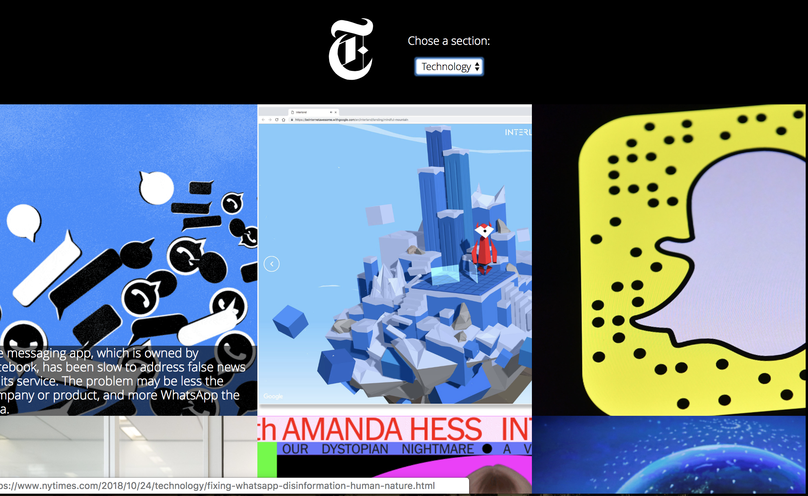
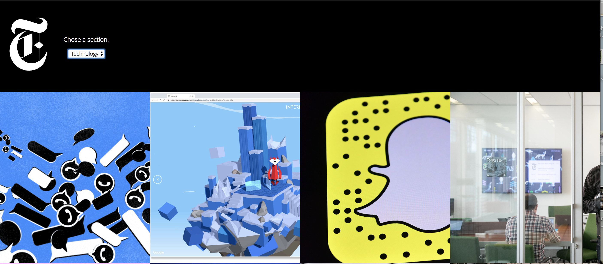

## Instanews

This project consisted of creating an Instanews page using the API of the New York Times. It's a responsive website that allows a user to filter top news story catagories. 

## Personal Learning 

This project has been really challenging. In theory I feel like I understand the lannguages and methods, however putting them into practice was really hard. I still struggle with Javascript and jQuery but I really enjoyed learning and using Sass. In my previous project, I found it hard to get my head around git and command line, but now I don't have to think about it. 

## Tools and Technologies

HTML, Sass, CSS animations, Gulp, Javascript, jQuery, Ajax.  

## Screenshots

# Mobile

# Tablet

# Desktop

